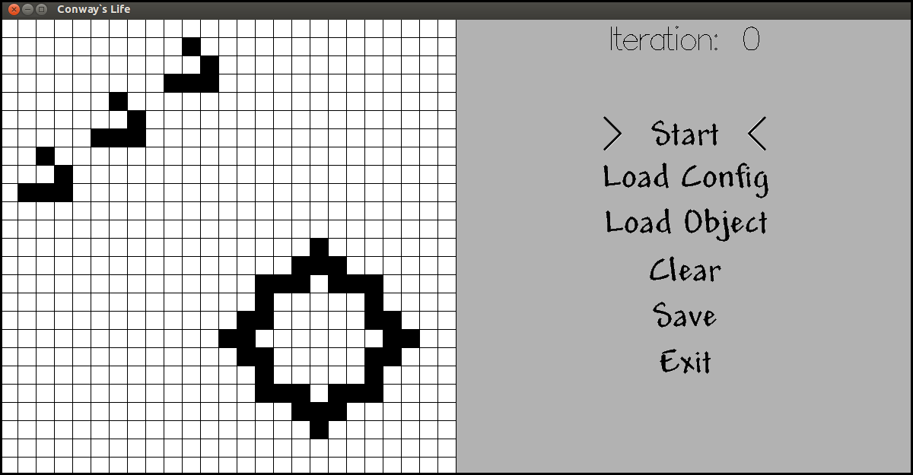

# conway-life

[](https://travis-ci.org/cmc-haskell-2015/conway-life)

Игра «Жизнь» Джона Конвея.



## Установка

Для установки клонируйте репозиторий и запустите `cabal install`:

```
$ git clone https://github.com/cmc-haskell-2015/conway-life.git
$ cd conway-life
$ cabal install
```
## Интерфейс

Пользователю предоставлена возможность с помощью мышки выбрать на поле живые 
клетки и запустить процесс моделирования с такой исходной конфигурацией. 
Используя панель меню, можно начать моделирование, загрузить отдельные
объекты или целую сцену, очистить поле, сохранить текущую конфигурацию и
выйти из игры. 
Доступные горячие клавиши: `F2` - сохранение и `ESC` - выход.

## База данных

В игре доступна база данных объектов и сцен.
При запуске игры происходит загрузка конфигурационных файлов. 
Файлы с ошибочными конфигурациями игнорируются, при этом выводятся сообщения 
об ошибке. 
При загрузке объекта можно выбрать его расположение на поле. Сцена из базы
данных полностью заменяет игровое поле. 
Текущую сцену можно сохранить с помощью соответствующего пункта меню или клавиши
`F2`. Конфигурационный файл сохраняется в `database/configs`. При следующем
запуске игры сцена будет доступна в меню загрузки.
